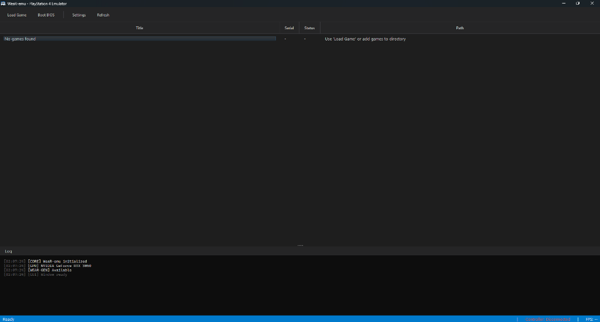

<p align="center">
  
</p>

<p align="center">
  <strong>Next-Gen Experimental PlayStation 4 Emulator</strong>
</p>

<p align="center">
  
  
  
  
  
</p>

---

## Overview

**WeaR-emu** is a cutting-edge PlayStation 4 emulator built from the ground up in **C++23**. It introduces the world's first **Adaptive Frame Generation (WeaR-Gen)** technology—a revolutionary approach that dynamically scales emulation performance from integrated GPUs to high-end discrete graphics cards.

> *"Emulation that adapts to you, not the other way around."*

---

## Key Features

### WeaR-Gen: Adaptive Frame Generation

The flagship feature of WeaR-emu. WeaR-Gen uses **Vulkan 1.3 Compute Shaders** to intelligently interpolate frames based on your hardware capabilities.

| Hardware Tier | VRAM | TFLOPs | WeaR-Gen Mode |
|---------------|------|--------|---------------|
| **High-End** (RTX 4070+) | ≥8GB | ≥15 | Full FP16 Interpolation |
| **Mid-Range** (RTX 3060) | ≥6GB | ≥10 | Hybrid FP16/FP32 |
| **Low-End** (iGPU) | <6GB | <10 | Disabled (Native Only) |

```
Frame N → [GPU Render] → WeaR-Gen Compute → Interpolated Frame N+0.5 → Display
```

### Deep Kernel Dark UI

A stunning, reactive interface inspired by modern gaming aesthetics:

- **Neon Accent System** — Dynamic color theming based on emulation state
- **Windows Acrylic Glass** — Native translucent backdrop integration
- **Real-time CPU Monitor** — Live register visualization (RIP, RAX, Opcodes)
- **Kernel Log Console** — Syscall tracing and debug output

### High-Level Emulation (HLE)

WeaR-emu prioritizes speed through comprehensive HLE of PS4 system libraries:

| Module | Coverage | Description |
|--------|----------|-------------|
| **libkernel** | ✅ Core | Memory, Threads, Syscalls |
| **libGnm** | ✅ Basic | GPU Command Processor, PM4 Packets |
| **libPad** | ✅ Full | Controller Input (Keyboard Mapping) |
| **libAudio** | ✅ Basic | PCM Audio Output via Qt6 |
| **libFS** | ✅ Core | Virtual File System with Mount Points |

### Technical Architecture

```
┌─────────────────────────────────────────────────────────────────┐
│                        WeaR_EmulatorCore                        │
├─────────────────────────────────────────────────────────────────┤
│  ┌─────────┐  ┌─────────────┐  ┌──────────────┐  ┌───────────┐ │
│  │ WeaR_Cpu│  │WeaR_Memory  │  │WeaR_GnmDriver│  │WeaR_Audio │ │
│  │ (x86-64)│  │ (4GB Guest) │  │ (PM4 Parser) │  │(QAudioSink│ │
│  └────┬────┘  └──────┬──────┘  └──────┬───────┘  └───────────┘ │
│       │              │                │                         │
│       └──────────────┴────────────────┘                         │
│                      │                                          │
│          ┌───────────▼───────────┐                              │
│          │   WeaR_RenderQueue    │                              │
│          │  (Thread-Safe Queue)  │                              │
│          └───────────┬───────────┘                              │
│                      │                                          │
│          ┌───────────▼───────────┐                              │
│          │  WeaR_RenderEngine    │                              │
│          │  (Vulkan 1.3 + VMA)   │                              │
│          │       ┌───────────┐   │                              │
│          │       │ WeaR-Gen  │   │                              │
│          │       │ (Compute) │   │                              │
│          │       └───────────┘   │                              │
│          └───────────────────────┘                              │
└─────────────────────────────────────────────────────────────────┘
```

---

## Current Status

| Component | Status |
|-----------|--------|
| CPU Interpreter | ✅ Basic x86-64 |
| Memory Management | ✅ 4GB Guest RAM |
| GPU Command Processor | ✅ PM4 Parsing |
| Vulkan Renderer | ✅ Fallback Pipeline |
| WeaR-Gen Frame Gen | ✅ Infrastructure Ready |
| Controller Input | ✅ Keyboard Mapping |
| Audio Output | ✅ 48kHz Stereo |
| File System | ✅ VFS with Mounts |

### Compatibility

Currently running:
- ✅ **Internal BIOS** (Built-in test payload)
- 🔄 **Homebrew samples** (In testing)
- 🔜 Commercial games (Pending shader recompilation)

---

## Roadmap

- [ ] **Phase 16**: Complete x86-64 instruction set
- [ ] **Phase 17**: GCN → SPIR-V shader recompiler
- [ ] **Phase 18**: Texture caching and render target management
- [ ] **Phase 19**: Game database and compatibility tracking
- [ ] **Phase 20**: Linux/macOS support

---

## Quick Start

```bash
# Clone the repository
git clone https://github.com/RidTheWann/WeaR-emu.git
cd WeaR-emu

# Build (see BUILD.md for detailed instructions)
mkdir build && cd build
cmake .. -G "Visual Studio 18 2026" -A x64 -DQt6_DIR="C:/Qt/6.10.1/msvc2022_64/lib/cmake/Qt6"
cmake --build . --config Release

# Deploy Qt dependencies
cd bin/Release
C:\Qt\6.10.1\msvc2022_64\bin\windeployqt.exe WeaR-emu.exe

# Run
./WeaR-emu.exe
```

See [BUILD.md](BUILD.md) for detailed build instructions.

---

## Screenshots

<p align="center">
  
</p>

| Feature | Status |
|---------|--------|
| GPU Detection | ✅ NVIDIA GeForce RTX 3060 |
| VRAM | ✅ 12.0 GB Detected |
| Compute Power | ✅ 5.9 TFLOPs |
| WeaR-GEN | ✅ Ready |

---

## Contributing

We welcome contributions! Please read [CONTRIBUTING.md](CONTRIBUTING.md) before submitting pull requests.

### Areas Needing Help

- **Shader Recompilation** — GCN to SPIR-V translator
- **CPU Instructions** — SSE/AVX support
- **Testing** — Game compatibility reports

---

## License

This project is licensed under the **GNU General Public License v2.0** — see the [LICENSE](LICENSE) file for details.

---

## Acknowledgments

- **Sony Interactive Entertainment** — For the PlayStation 4 architecture
- **Vulkan-HPP** — Modern C++ Vulkan bindings
- **VMA** — Vulkan Memory Allocator
- **Qt Project** — Cross-platform UI framework
- The broader emulation community for inspiration

---

<p align="center">
  <strong>Architected & Developed by <a href="https://github.com/RidTheWann">RidTheWann</a></strong>
</p>

<p align="center">
  <em>WeaR-emu — Where Vision Meets Emulation</em>
</p>
